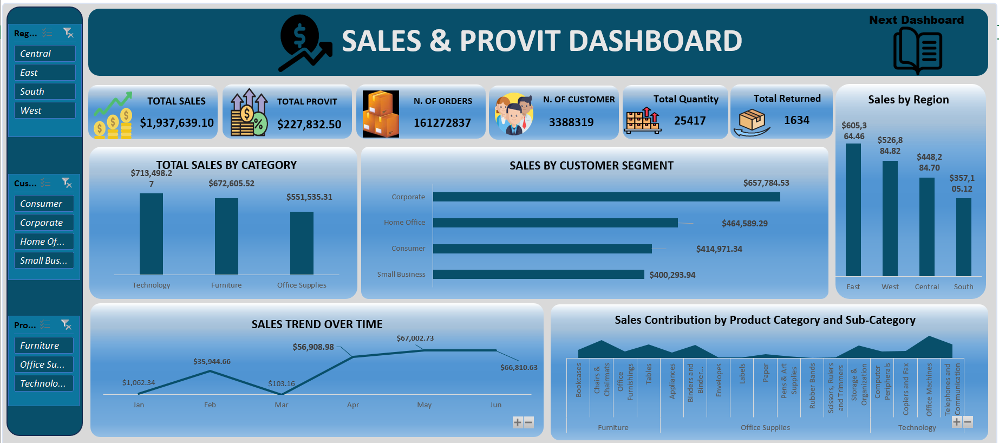
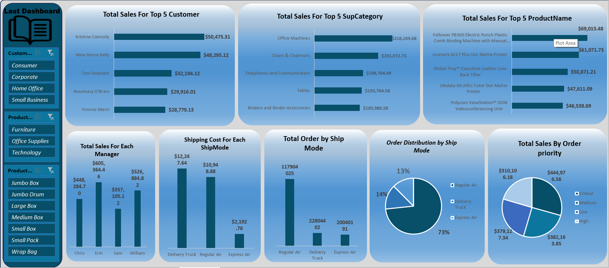

# E-commerce-Business-Insights-Dashboard
Interactive Excel dashboard for analyzing e-commerce sales, profit, and customer insights using Power Query and Pivot Tables.

##  Project Overview
This project is an interactive **Excel Dashboard** designed to analyze and visualize e-commerce business data.  
It helps identify trends in **sales**, **profits**, and **customer segments** across different **regions** and **product categories**.

---

##  Data Preprocessing
Data cleaning and transformation were performed in **Power Query**, including:
- Removing duplicates and null values  
- Converting data types  
- Calculating new columns for profit and profit margin  
- Ensuring consistency across categorical fields  

---

##  Pivot Table Analysis
Pivot Tables were used to summarize and analyze:
- **Sales by Region**
- **Profit by Product Category**
- **Customer Segment Distribution**

---

##  Dashboard Features
- KPI Cards: Sales, Profit, Quantity, and Profit Margin  
- Charts for regional and product performance  
- **Slicers:** Region, Customer Segment, Product Category  
- Navigation buttons for smooth page transitions  

---

##  Tools Used
- Microsoft Excel  
- Power Query  
- Pivot Tables  
- Data Visualization Techniques  

---

##  Screenshots

---

##  Author
**Nancy Nabil**  
_Data Analyst | Excel | Power BI | SQL | Python_  
