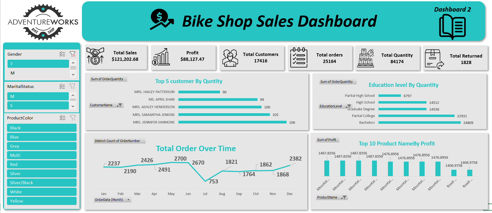
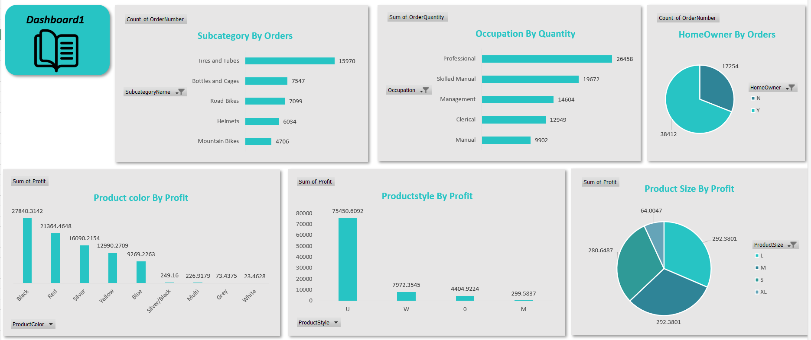

# SQL-and-Excel-Sales-Analysis-Dashboard

Data analysis project combining SQL queries and Excel dashboards for business insights.

## Project Overview
This project integrates **SQL** and **Excel** to analyze sales data efficiently.
SQL was used to extract and filter data, while Excel was used for analysis and dashboard creation.

---

## Data Extraction
Data was extracted using **SQL queries**, including:
- Filtering relevant records
- Aggregating sales and profit
- Grouping data by categories and customers

---

## Excel Analysis
The extracted data was analyzed in Excel using:
- Pivot Tables
- Calculated fields
- Charts and dashboards

---

## Dashboard Features
- KPI cards for sales, profit, and orders
- Customer and product analysis
- Interactive slicers for filtering
- Clear visual representation of insights

---

## Tools Used
- SQL
- Microsoft Excel
- Pivot Tables
- Data Visualization Techniques

---

## Screenshots

---

## Author
**Nancy Nabil**  
_Data Analyst | Excel | Power BI | SQL | Python_
