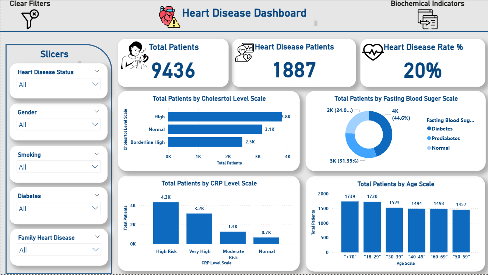

# Heart-Disease-Analysis-Dashboard

Interactive Power BI dashboard for analyzing heart disease data and medical risk factors.

## Project Overview
This project focuses on analyzing **heart disease data** using **Power BI**.
The dashboard highlights key health indicators and relationships between medical attributes.

---

## Data Preparation
Data preparation included:
- Cleaning and transforming data
- Creating calculated measures using DAX
- Converting numeric medical values into standardized categorical ranges
  (e.g., blood pressure and cholesterol levels)

---

## Dashboard Analysis
The dashboard analyzes:
- Heart disease distribution
- Patient demographics
- Medical risk factors
- Relationships between health attributes

---

## Dashboard Features
- Interactive visuals
- Filters and slicers
- Clear comparison between patient groups
- Medical insights presented visually

---

## Tools Used
- Power BI
- DAX
- Data Modeling
- Data Visualization Techniques

---

## Screenshots

[ Biochemical Indicator](Dashboard2.png)
[Lifestyle](Dashboard3.png)
---

## Author
**Nancy Nabil**  
_Data Analyst | Excel | Power BI | SQL | Python_
