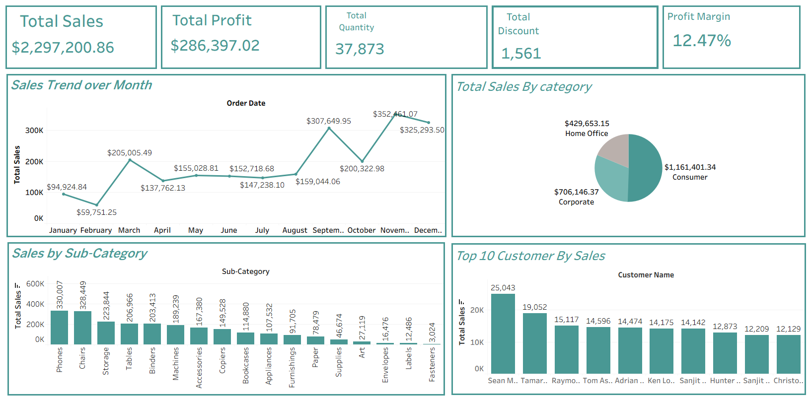

# Tableau-Data-Visualization-Dashboard

Interactive Tableau dashboard for exploring data patterns and trends visually.

## Project Overview
This project uses **Tableau** to analyze and visualize data through interactive dashboards.
It focuses on discovering patterns, trends, and relationships within the dataset.

---

## Data Preparation
The data was prepared to ensure:
- Clean and consistent structure
- Correct data types
- Readiness for visualization

---

## Visualization Analysis
The dashboard provides:
- Trend analysis
- Category comparisons
- Interactive exploration of data

---

## Dashboard Features
- Interactive filters
- Dynamic visualizations
- Clear and intuitive layout
- Visual storytelling approach

---

## Tools Used
- Tableau
- Data Visualization Techniques
- Interactive Dashboards

---

## Screenshots

[Detailed Insights](Dashboard2.png)
[Ship Time](Dashboard3.png)
---

## Author
**Nancy Nabil**  
_Data Analyst | Excel | Power BI | SQL | Python_
